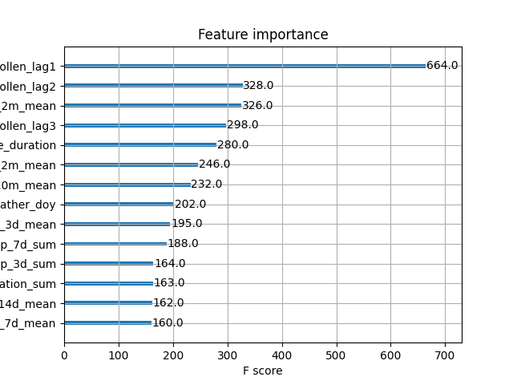
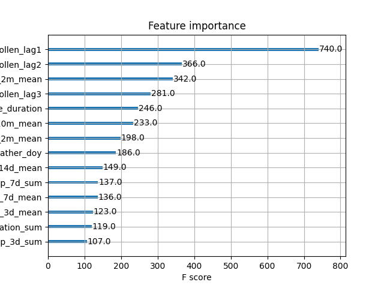
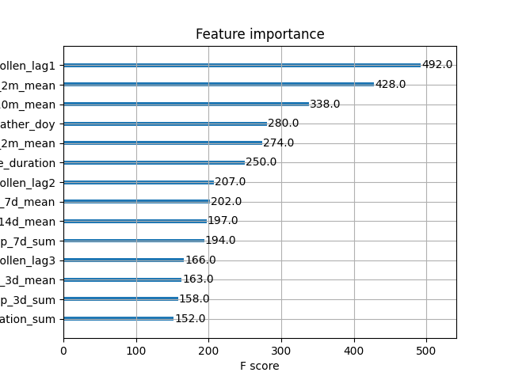
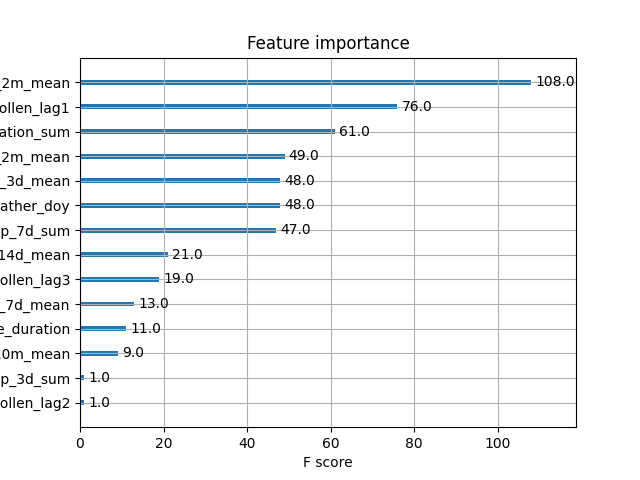
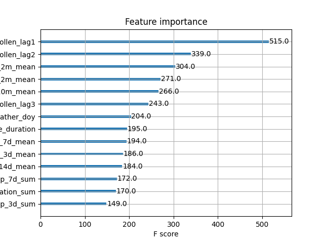
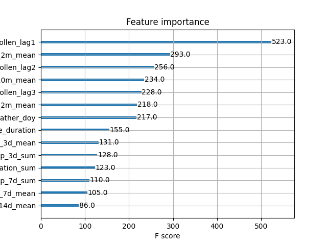

# Pollen-Predictor
Pollen Predictor

This project is about pollen prediction in Stockholm. Each morning, we ingest:
Max pollen levels for yesterday (for alder pollen, birch pollen, grass pollen, mugwort pollen, olive pollen and ragweed pollen)
A 9 day weather forecast for the following daily variables:
- "temperature_2m_mean",
- "precipitation_sum", 
- "dew_point_2m_mean", 
- "wind_speed_10m_mean", 
- "sunshine_duration", 

The task is to predict the maximum levels of pollen for each pollen type and forecasted day.

We use the following features: 
- doy (day of year, 1–366)
- temperature_2m_mean (from which we create: 7-day rolling mean of temp, 14-day rolling mean of temp)
- precipitation_sum (from which we create: precip_1d, precip_3d_sum, precip_7d_sum)
- dewpoint_2m_mean --> (from which we create: 3-day rolling mean)
- wind_speed_10m_mean
- Sunshine Duration

Further, we also use lagged values (pollen levels for t-1, t-2, t-3) to make the predictions (for day t). Autoregressive multi-step forecasting is used.

We have trained one model per pollen type have have measured performance for each model at different time horizons. Note that R squared is for predicting levels for day t with data from t-1 (same as for MSE_h1):

Grass pollen model: 

| Metric  | Value |
|---------|-------|
| R²      | 0.8602 |
| MSE     | 5.5935 |
| MSE_h1  | 5.7022 |
| MSE_h2  | 8.4433 |
| MSE_h3  | 7.5775 |
| MSE_h4  | 5.8524 |
| MSE_h5  | 6.5259 |
| MSE_h6  | 7.2237 |
| MSE_h7  | 7.8990 |
<!-- -->

Birch pollen model:
| Metric  | Value |
|---------|-------|
| R²      | 0.5684 |
| MSE     | 14195 |
| MSE_h1  | 14471 |
| MSE_h2  | 18645 |
| MSE_h3  | 21971 |
| MSE_h4  | 20586 |
| MSE_h5  | 23315 |
| MSE_h6  | 23622 |
| MSE_h7  | 24482 |
<!---->

Alder pollen model:
| Metric  | Value |
|---------|-------|
| R²      | 0.0989 |
| MSE     | 85.611 |
| MSE_h1  | 87.275 |
| MSE_h2  | 95.338 |
| MSE_h3  | 94.438 |
| MSE_h4  | 96.753 |
| MSE_h5  | 96.258 |
| MSE_h6  | 99.829 |
| MSE_h7  | 100.95 |

<!---->

Olive pollen model: 
| Metric  | Value |
|---------|-------|
| R²      | 0 |
| MSE     | 0.0001 |
| MSE_h1  | 0.0001 |
| MSE_h2  | 0.0001 |
| MSE_h3  | 0.0001 |
| MSE_h4  | 0.0001 |
| MSE_h5  | 0.0001 |
| MSE_h6  | 0.0001 |
| MSE_h7  | 0.0001 |

<!---->

Mugwort pollen model: 
| Metric  | Value |
|---------|-------|
| R²      | 0.8818 |
| MSE     | 1.8814 |
| MSE_h1  | 1.918 |
| MSE_h2  | 2.1848 |
| MSE_h3  | 2.7729 |
| MSE_h4  | 2.758 |
| MSE_h5  | 3.7274 |
| MSE_h6  | 3.6399 |
| MSE_h7  | 3.5608 |

<!---->

Ragweed pollen model:
| Metric  | Value |
|---------|-------|
| R²      | 0.7448 |
| MSE     | 4.4953 |
| MSE_h1  | 4.5827 |
| MSE_h2  | 4.1479 |
| MSE_h3  | 1.7903 |
| MSE_h4  | 2.7327 |
| MSE_h5  | 2.3723 |
| MSE_h6  | 3.1645 |
| MSE_h7  | 6.6614 |

<!---->

As we can see from these results, the models for ragweed, mugwort, and grass pollen performed quite well. The model for birch pollen also had a reasonable performance. We generally observe that MSE grows with the forcasting horizon which is expected as we use a autoregressive approach, meaning that errors will propagate. 

Olive pollen is quite rare and low in Stockholm. This means that the task is rather trivial and therefore, we observe a R squared of 0. The model for alder pollen, however, performed quite poorly. When we inspect the data for alder pollen, we can see that it is quite unpredictable. For example, we have this day in the test set:
| Time  | Value |
|------------|-------|
| 00:00 | 0.0 |
| 01:00 | 0.0 |
| 02:00 | 0.0 |
| 03:00 | 0.0 |
| 04:00 | 0.0 |
| 05:00 | 0.0 |
| 06:00 | 0.0 |
| 07:00 | 0.0 |
| 08:00 | 0.0 |
| 09:00 | 0.0 |
| 10:00 | 0.0 |
| 11:00 | 0.0 |
| 12:00 | 0.0 |
| 13:00 | 0.0 |
| 14:00 | 0.0 |
| 15:00 | 0.0 |
| 16:00 | 0.5 |
| 17:00 | 0.0 |
| 18:00 | 1.3 |
| 19:00 | 9.2 |
| 20:00 | 148.1 |
| 21:00 | 71.4 |
| 22:00 | 21.4 |
| 23:00 | 10.9 |

Here we can observe that that the levels shoot up from 0 to 148 (the higest recorded value in all of 2025) in a matter of a few hours, making it very difficult to predict. 

In a real system, the performance for some of these models are not sufficiently good to use the model, but we decided to publish all of them to enable comparision between them. 

